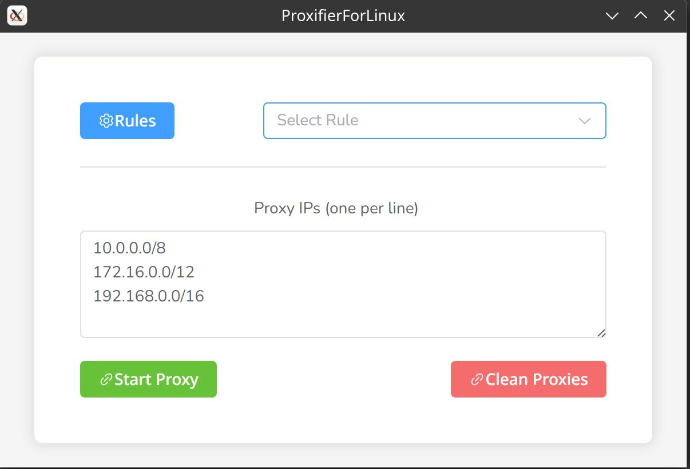
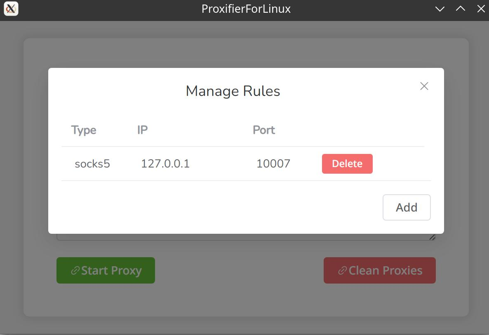
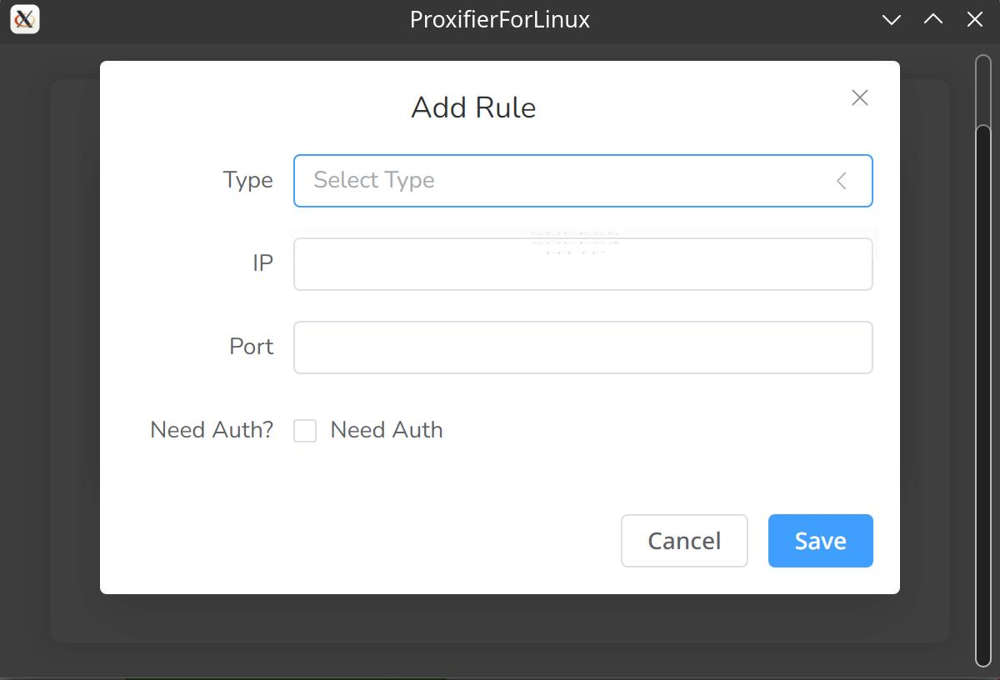

# ProxifierForLinux

 [中文介绍](README_zh.md) 

## Introduction

This tool is a tool that uses redsocks and iptables to implement a transparent proxy similar to Proxifier.

## Compile

```
git clone https://github.com/Rubby2001/ProxifierForLinux.git
cd ProxifierForLinux
wails build
```

## Usage

1. Install redsocks(https://github.com/darkk/redsocks).
2. Add `redsocks` group and `redsocks` user:

```bash
groupadd redsocks
useradd -g redsocks redsocks
```

3. Run ProxifierForLinux as root.

```
sudo ./ProxifierForLinux
```

4. Add a rule and start proxy.

## ScreenShots









